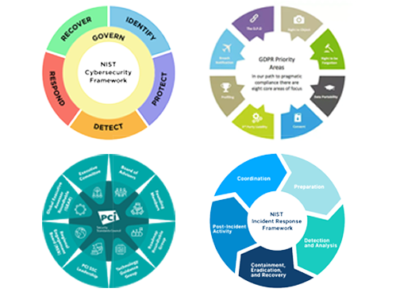

# Internal-Security-Audit-Botium-Toys
"A comprehensive internal IT security audit for Botium Toys, highlighting compliance with NIST CSF, PCI DSS, GDPR, and SOC frameworks. Includes controls assessment, compliance checklist, and recommendations for improving security posture."

" *Botium Toys*
 is a small U.S. business that develops and sells toys. The business has a single physical location, which serves as their main office, a storefront, and warehouse for their products. However, Botium Toy’s online presence has grown, attracting customers in the U.S. and abroad. As a result, their information technology (IT) department is under increasing pressure to support their online market worldwide. 

The manager of the IT department has decided that an internal IT audit needs to be conducted. She's worried about maintaining compliance and business operations as the company grows without a clear plan. She believes an internal audit can help better secure the company’s infrastructure and help them identify and mitigate potential risks, threats, or vulnerabilities to critical assets. The manager is also interested in ensuring that they comply with regulations related to internally processing and accepting online payments and conducting business in the European Union (E.U.).   

The IT manager starts by implementing the National Institute of Standards and Technology Cybersecurity Framework (NIST CSF), establishing an audit scope and goals, listing assets currently managed by the IT department, and completing a risk assessment. The goal of the audit is to provide an overview of the risks and/or fines that the company might experience due to the current state of their security posture."

# Internal Security Audit for Botium Toys
This project showcases a comprehensive internal IT security audit conducted for Botium Toys, a fictional company. The audit follows the **NIST Cybersecurity Framework (CSF)** and evaluates compliance with **PCI DSS**, **GDPR**, and **SOC** standards.

The project highlights:
- Security controls assessment
- Compliance best practices checklist
- Actionable recommendations to improve security posture

## Table of Contents
1. [Project Scope](#project-scope)
2. [Audit Frameworks](#audit-frameworks)
3. [Artifacts and Deliverables](#artifacts-and-deliverables)
4. [Findings and Recommendations](#findings-and-recommendations)
5. [Key Learnings](#key-learnings)
6. [How to Use This Repository](#how-to-use-this-repository)
7. [About Me](#about-me)

### Project Scope
The internal audit was conducted to:
- Assess Botium Toys' IT security controls.
- Identify risks, threats, and vulnerabilities.
- Evaluate compliance with regulatory frameworks.
- Provide actionable recommendations to enhance security posture.

### Audit Frameworks
The audit utilized the following frameworks:
- **NIST CSF**: For identifying, protecting, detecting, responding, and recovering from risks.
- **PCI DSS**: For securing customer payment data.
- **GDPR**: For ensuring data privacy for E.U. customers.
- **SOC (Type 1 & 2)**: For evaluating user access, data confidentiality, and integrity.

### Artifacts and Deliverables
- **Controls and Compliance Checklist**:  
  - [Download the completed checklist](src/Compliance_Checklist_Completed.xlsx)
- **Audit Scope and Goals**:  
  - [View the document](docs/Audit_Scope_and_Goals.pdf)
- **Risk Assessment Report**:  
  - [View the document](docs/Risk_Assessment_Report.pdf)
- **Audit Findings and Recommendations**:  
  - [View recommendations](src/Internal_Audit_Controls_Report.md)
- **Framework Diagram**:  
  - 

### Findings and Recommendations
Key gaps identified include:
- Lack of least privilege enforcement.
- Absence of encryption and robust password management.
- Missing intrusion detection system and disaster recovery plans.

**Recommendations**:
1. Implement role-based access controls.
2. Adopt a centralized password management system.
3. Deploy encryption for data at rest and in transit.
4. Establish a comprehensive disaster recovery plan.

### Key Learnings
This project enhanced my skills in:
- Conducting IT security audits.
- Applying NIST CSF for risk and compliance management.
- Identifying and mitigating vulnerabilities in organizational security postures.

### How to Use This Repository
1. Clone the repository:
   ```bash
   git clone https://github.com/yourusername/Internal-Security-Audit-Botium-Toys.git

#### **About Me**
```markdown
### About Me
I am Hamim Mahamud Hamy, a Certified Ethical Hacker (CEH) and cybersecurity professional specializing in vulnerability assessment and IT compliance audits.  
[Portfolio](https://hamilio.netlify.app) | [LinkedIn](https://www.linkedin.com/in/hamim-mahmud/) | [Email](mailto:hmmahmud145@gmail.com)
